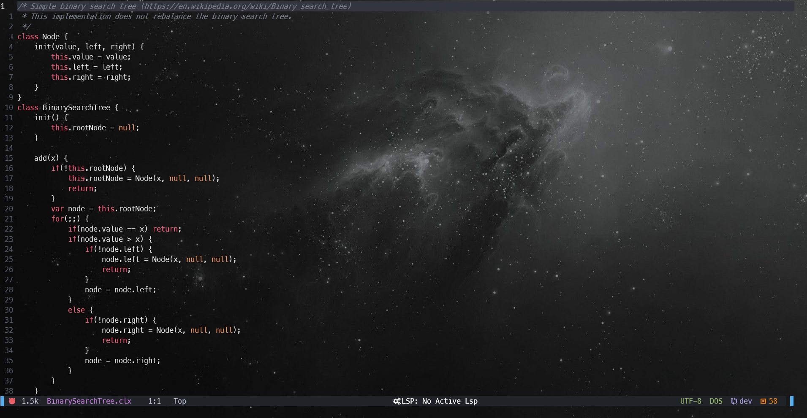

# cellox.vim

Provides syntax highlighting for [Cellox](https://github.com/FrederikTobner/Cellox) in vim and neovim.



## Installation

### Using no plugin manager

The plugin should work with Vim/NeoVim's native plugin manager out of the box. You should be able to configure the plugin under unix-like systems like that:

```
cd ~/.vim/pack/plugins/start && git clone https://github.com/FrederikTobner/cellox.vim
```

### Using Plug

You can quickly install the plugin using [plug](https://github.com/junegunn/vim-plug) by adding the following line to your Vim or NeoVim configuration file Vim-Plug plugin section

```
Plug 'FrederikTobner/cellox.vim'
```

and then run PlugInstall.

## Usage

Typing the command :CelloxRun interprets the current script
